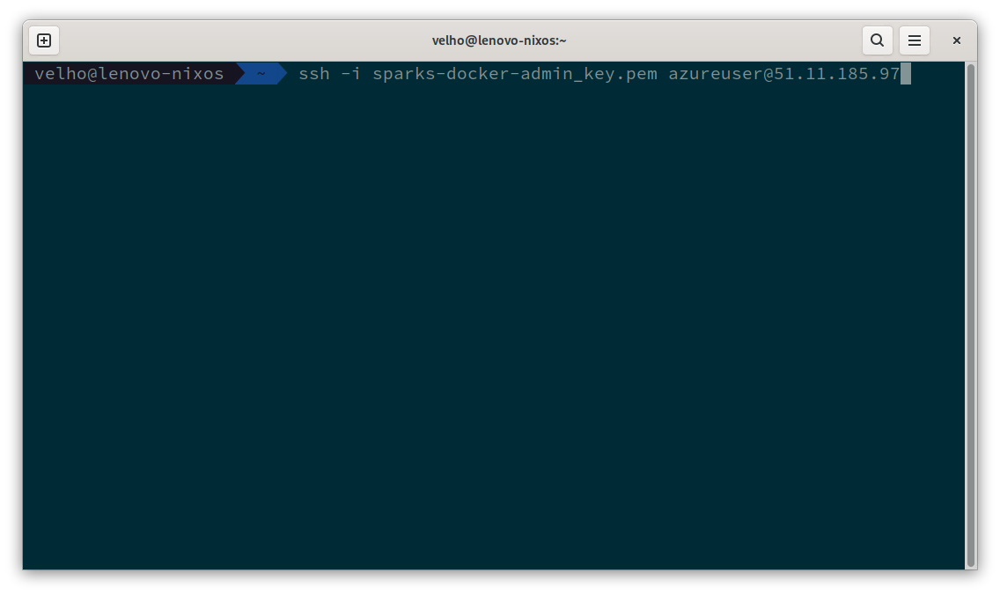
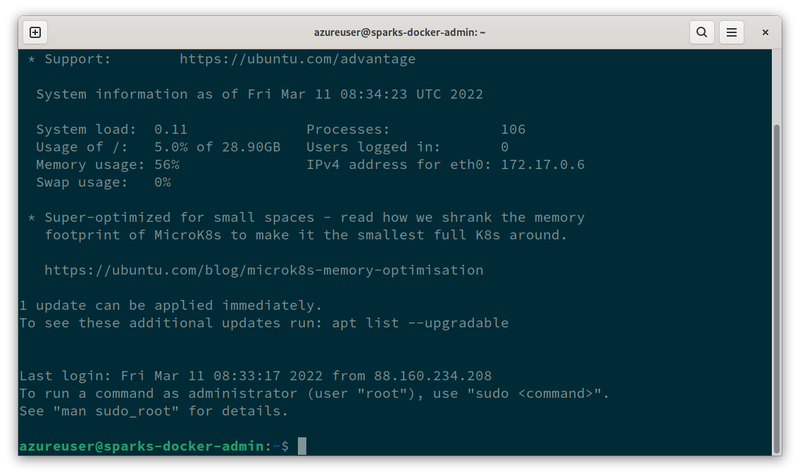

# Install docker on provided Ubuntu VM

## Access Ubuntu VM

The VM is available to access it use your private key and the ip of your host as follows:

```bash
ssh -i <providedkey.pem> azureuser@<my.vm.ip>
```



The `<providedkey.pem>` and `<my.vm.ip>` should be replaced by your personal credentials, every attendee has its own VM.
These VMs are lightweight typically 1 VCPU, 1 GB of RAM, and 30 GB SSD storage.



Once logged in you can test that you have `sudo` access on the VM. To do so execute any command with `sudo`, for
instance try to list the content of the root home directory, this command should fail without superuser permissions.

```bash
ls /root
# ls: cannot open directory '/root': Permission denied

sudo ls /root
# snap
```

Feel free to switch to the root user, if you need to, by using the `su` command.

## **Exercise**: Discover the ubuntu and Linux kernel version installed on your vm

- Try command uname -a

## **Exercise**: Install docker

Now that you are allowed on your working VM and can execute commands as superuser the next step is to install docker.
Docker comes bundled as a daemon and a client, both can easily be installed with their dependencies by simply following
the official instructions here:

https://docs.docker.com/engine/install/ubuntu/

> See the [solution](./answer/01-01-install_docker.md)

## Check docker daemon health

To check that the daemon is running you use systemctl as follows:

```bash
azureuser@sparks-docker-admin:~$ sudo systemctl status docker
● docker.service - Docker Application Container Engine
     Loaded: loaded (/lib/systemd/system/docker.service; enabled; vendor preset: enabled)
     Active: active (running) since Fri 2022-03-11 08:50:16 UTC; 22min ago
TriggeredBy: ● docker.socket
       Docs: https://docs.docker.com
   Main PID: 15832 (dockerd)
      Tasks: 9
     Memory: 42.1M
     CGroup: /system.slice/docker.service
             └─15832 /usr/bin/dockerd -H fd:// --containerd=/run/containerd/containerd.sock

Mar 11 08:50:15 sparks-docker-admin dockerd[15832]: time="2022-03-11T08:50:15.917234968Z" level=warning msg="Your kernel does >
Mar 11 08:50:15 sparks-docker-admin dockerd[15832]: time="2022-03-11T08:50:15.917717663Z" level=info msg="Loading containers: >
Mar 11 08:50:16 sparks-docker-admin dockerd[15832]: time="2022-03-11T08:50:16.167886502Z" level=info msg="Default bridge (dock>
Mar 11 08:50:16 sparks-docker-admin dockerd[15832]: time="2022-03-11T08:50:16.264564751Z" level=info msg="Loading containers: >
Mar 11 08:50:16 sparks-docker-admin dockerd[15832]: time="2022-03-11T08:50:16.534233699Z" level=warning msg="Not using native >
Mar 11 08:50:16 sparks-docker-admin dockerd[15832]: time="2022-03-11T08:50:16.534636295Z" level=info msg="Docker daemon" commi>
Mar 11 08:50:16 sparks-docker-admin dockerd[15832]: time="2022-03-11T08:50:16.535195090Z" level=info msg="Daemon has completed>
Mar 11 08:50:16 sparks-docker-admin dockerd[15832]: time="2022-03-11T08:50:16.685820108Z" level=info msg="API listen on /run/d>
Mar 11 08:50:16 sparks-docker-admin systemd[1]: Started Docker Application Container Engine.
Mar 11 08:58:02 sparks-docker-admin dockerd[15832]: time="2022-03-11T08:58:02.565716599Z" level=info msg="ignoring event" cont>
lines 1-21/21 (END)
```

On the printed logs `active (running)` means the daemon is currently running and waiting for client calls.

## Run docker containers

Finally, you can check your docker installation is working by running a simple hello-world container. Note that you will
need to use sudo to issue docker commands. Alternatively, to avoid requiring sudo to run docker client, you can
add `azureuser` to the `docker` group.

```sh
# WARNING need to logout and login again to take effect
 sudo usermod -aG docker $USER
```


## **Exercise**: Run the hello-world container

Test with te hello-world container. What does the output say?

> See the [solution](./answer/01-02-run_hello-world.md)

## **Exercise**: docker info

Analyze the output of `docker info` command.


