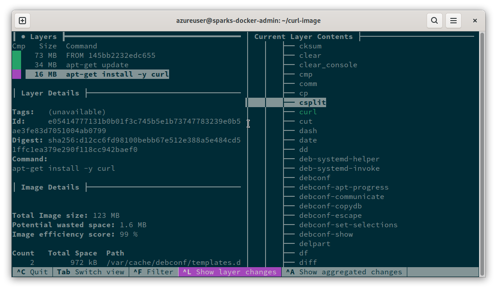
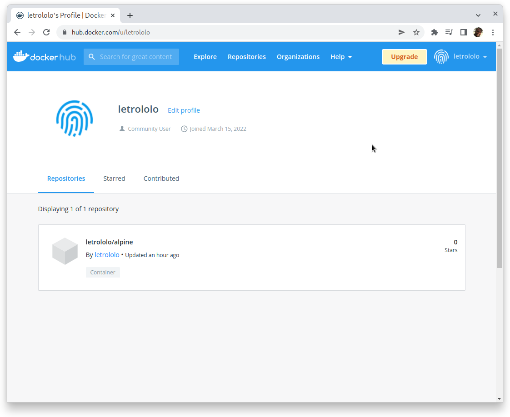
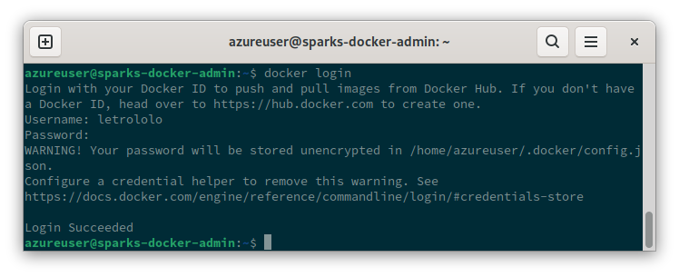

# Build your own images

Now that you know how docker works we will build our own images and think about the best way of doing so.
When creating an image docker will pull any layers it needs to start building it locally, then it will
create several layers for the many commands you reference no your Dockerfile. 

For instance, the `Dockerfile` below create a new image based on the ubuntu base image and its layers.
The `RUN` commands will install curl using `apt-get` and finally the `ENTRYPOINT` specify a list
of program arguments to call upon container instantiation by default.

```shell
FROM ubuntu

RUN apt-get update
RUN apt-get install -y curl

ENTRYPOINT [ "bash" ]
```

To build the image you need that the current directory is the one containing the `Dockerfile`, after you 
must run `docker build` command, option --tag/-t can be used to specify a name for the new image.

```shell
docker build -t ubuntu:curl .
# ...
#Updating certificates in /etc/ssl/certs...
#0 added, 0 removed; done.
#Running hooks in /etc/ca-certificates/update.d...
#done.
#Removing intermediate container 074146563e4a
# ---> a2acf17a0db7
#Step 4/4 : ENTRYPOINT [ bash ]
# ---> Running in 62b4550755c9
#Removing intermediate container 62b4550755c9
# ---> 9439db5fdc05
#Successfully built 9439db5fdc05
#Successfully tagged ubuntu:curl

# Chech the images with -a option to see that indeed 2 images were added
docker images -a
#REPOSITORY   TAG          IMAGE ID       CREATED          SIZE
#ubuntu       curl         9439db5fdc05   4 seconds ago    123MB
#<none>       <none>       a2acf17a0db7   6 seconds ago    123MB
```

Using dive we can see more accurately what each of the layers represent.




## **Exercise**: Build a healthz image from scratch

Create a `Dockerfile` and use the commands learnt to create an image that has the healthz.py command and all
dependencies necessary.

> See the [solution](./answer/04-01-healthz.md)


## **Exercise**: Make layers less heavy

Use the `FROM` builder pattern to better manage layer difference and make your image as light as possible in terms
of disk usage. Use the base `python:3.7-alpine`.

> See the [solution](./answer/04-02-healthz_light.md)

## **Exercise**: Save image on tgz and load it back

Use `docker save` to save the image on a tgz file, remove the image from the local registry and add it again
from the tgz file. Run the image to assure it is working as expected.

> See the [solution](./answer/04-03-save_load.md)


## Dockerhub

Dockerhub is a registry maintained by Docker Inc. this repository can be used free for public projects.



To continue with this tutorial we first need to create an account, please use an e-mail that you have access
since e-mail confirmation is required.


Finally, you need to login as your user so it will allow you to push, upload, images too.




## **Exercise**: Push your image to dockerhub

Create an account on dockerhub.com and push your image there, remeber to tag it properly with
`<username>/<image_name>:<image_tag>`.

> See the [solution](./answer/04-04-push_pull.md)
